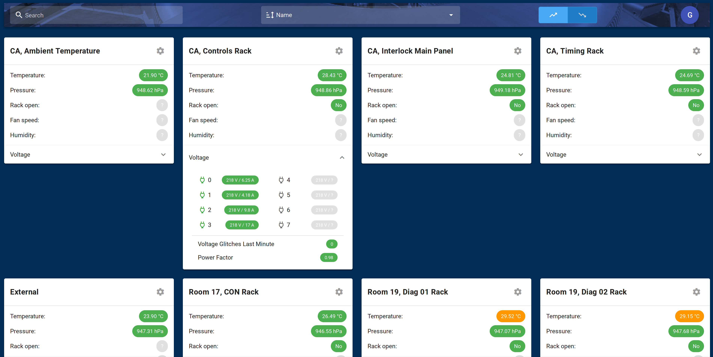

# SIMAR Front end


Example screencap with one BBB reading temperature and pressure data (dummy voltage and RPM data)

## Project setup
```
yarn install
```

### Compiles and hot-reloads for development
```
yarn serve
```

### Compiles and minifies for production
```
yarn build
```

### Lints and fixes files
```
yarn lint
```

### Direct deployment

Just copy `dist` to your server